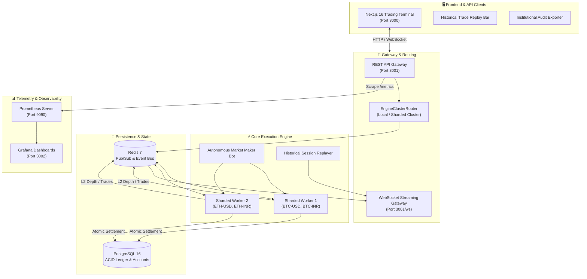

# ⚡ VelocityBook

> **High-Frequency In-Memory Matching Engine, ACID Double-Entry Financial Ledger, Distributed Cluster Workers, and Institutional Trading Terminal**

[](docs/ARCHITECTURE.md)
[](scripts/stress-test.ts)
[](docs/TRADE_LIFECYCLE.md)
[](packages/engine/src/__tests__)
[](grafana/dashboards)
[](packages/frontend)

VelocityBook is a full-stack, institutional-grade cryptocurrency and financial exchange built from first principles in TypeScript, Node.js, and PostgreSQL. It delivers sub-millisecond order matching, distributed worker clustering, zero-copy protocol serialization, an immutable double-entry financial ledger, Prometheus/Grafana telemetry, and a dark, high-contrast Bloomberg-pro trading terminal.

---

## 🌟 Key Capabilities & Highlights

### ⚡ 1. Microsecond In-Memory Matching Engine
- **Deterministic Price-Time Priority (FIFO)** matching running fully in-memory with $O(1)$ order cancellations and $O(\log P)$ price level insertions.
- **Advanced Order Types Supported**:
  - `LIMIT`: Standard resting limit orders with price protection.
  - `MARKET`: Aggressive liquidity-consuming market orders with slippage protection.
  - `STOP_LOSS`: Triggers a market order once market price crosses the designated stop price.
  - `TRAILING_STOP`: Dynamically updates the trigger stop price following positive market watermarks by a specified delta distance.
  - `ICEBERG`: Splits large orders into visible display slices and hidden resting liquidity to minimize market impact.
  - `FILL_OR_KILL (FOK)`: Requires immediate and complete execution; otherwise, the order is cancelled in its entirety without resting.

### 🏛️ 2. Immutable ACID Double-Entry Financial Ledger
- Regulatory-grade financial accounting ensuring **$\sum \text{Debits} \equiv \sum \text{Credits}$** across all accounts for every trade execution.
- Every match atomically generates **4 balanced ledger entries** (Buyer Cash Debit, Buyer Asset Credit, Seller Cash Credit, Seller Asset Debit) inside a serialized PostgreSQL transaction.
- Zero floating-point drift: Powered by `decimal.js` with exact 28-digit precision and 8 decimal places (`NUMERIC(28, 8)`).

### 🛡️ 3. Pre-Trade Risk & Margin Controls
- Real-time pre-trade validation preventing account overdrafts and negative balances.
- Utilizes pessimistic row-level database locking (`SELECT ... FOR UPDATE`) during order placement and cancellation.
- Strict available-vs-locked capital compartmentalization guarantees commitments cannot be double-spent.

### 🌐 4. Sharded Engine Workers & Cluster Router
- Supports horizontal scaling through partitioned matching engine worker processes (`EngineWorker`).
- Symbol-based sharding via Redis cluster bus:
  - **Worker 1**: Quotes and matches `BTC-INR` and `BTC-USD`.
  - **Worker 2**: Quotes and matches `ETH-INR` and `ETH-USD`.
- High-performance binary and Protocol Buffers serialization (`ProtocolSerializer`) for minimal network serialization overhead.

### 📊 5. Prometheus Observability & Grafana Dashboards
- Native Prometheus `/metrics` endpoint powered by `prom-client`.
- Live measurement of **order latency histograms**, **execution throughput**, **top-of-book bid/ask spread**, **resting order book depth**, and **active WebSocket client counts**.
- Pre-provisioned Grafana monitoring dashboards accessible at `http://localhost:3002`.

### ⏪ 6. Historical Market Replay Engine
- Replay recorded historical market data or synthetic trading sessions tick-by-tick into live WebSocket channels.
- Configurable playback speeds (**1x, 5x, 10x, 60x**) with Play, Pause, Resume, and Stop controls in both the terminal UI ribbon and CLI.

### 📑 7. Institutional Regulatory Data Exports
- One-click CSV and JSON datasets available directly in the terminal interface:
  - **Trade Execution Logs**: Timestamped tick logs with execution IDs, counterparties, and microsecond timestamps.
  - **Double-Entry Audit Journal**: Complete ledger transactions verifying conservation of capital.
  - **Risk & Capital Commitment Reports**: System-wide liquidity allocation, locked capital ratios, and solvency distribution.

### 🖥️ 8. Bloomberg-Pro Trading Terminal
- High-performance Next.js 16 (Turbopack) & React 19 interface.
- 60 FPS Canvas candlestick and volume histogram powered by TradingView `lightweight-charts`.
- Real-time L2 order book depth ladder with depth visualizations and animated price flash indicators.
- Multi-currency dynamic switching between **Indian Rupee (INR / ₹)** and **US Dollar (USD / $)** with currency-aware number formatting (`en-IN` lakhs vs `en-US` thousands).

---

## 🏗️ Architecture & Data Flow



---

## 🚀 Quick Start

### Option A: Complete Docker Compose Stack (Recommended)

Start all services (PostgreSQL 16, Redis 7, Engine Workers, Backend Gateway, Next.js Terminal, Prometheus, and Grafana) with a single command:

```bash
docker compose up -d
```

| Service | URL / Port | Description |
| :--- | :--- | :--- |
| **Trading Terminal** | [http://localhost:3000](http://localhost:3000) | Next.js 16 SSR Trading Interface |
| **REST API Gateway** | [http://localhost:3001](http://localhost:3001) | Exchange API, Orders, Reports & Replay |
| **WebSocket Feed** | `ws://localhost:3001/ws` | Real-time L2 depth & trade execution ticker |
| **Prometheus Metrics** | [http://localhost:9090](http://localhost:9090) | Observability scraper querying `/metrics` |
| **Grafana Dashboards** | [http://localhost:3002](http://localhost:3002) | Real-time throughput & latency visualization |
| **PostgreSQL 16** | `localhost:5433` | ACID double-entry financial ledger database |
| **Redis 7** | `localhost:6379` | High-speed Pub/Sub messaging and cluster bus |

---

### Option B: Local Monorepo Development

#### Prerequisites
- **Node.js**: `>= 18.0.0`
- **Docker** (for PostgreSQL 16 & Redis 7):

```bash
# 1. Start database & cache infrastructure
docker compose up -d postgres redis prometheus grafana

# 2. Install workspace dependencies
npm install

# 3. Build engine workspace package
npm run build --workspace=@velocitybook/engine

# 4. Start Backend in development mode
npm run dev:backend

# 5. Start Frontend in development mode (in a new terminal)
npm run dev:frontend
```

---

## 🧪 Comprehensive Verification & Benchmarks

VelocityBook includes exhaustive test suites validating every layer of the exchange stack:

### 1. Engine Vitest Unit Tests (55 Tests)
Validates price-time priority, FIFO queue order, advanced orders (Stop-Loss, Trailing Stop, Iceberg, Fill-or-Kill), depth calculations, and serialization:

```bash
npm test
```

```
✓ src/__tests__/advancedOrders.test.ts (27 tests)
✓ src/__tests__/matching.test.ts (21 tests)
✓ src/__tests__/serialization.test.ts (7 tests)

Test Files  3 passed (3)
     Tests  55 passed (55)
```

### 2. High-Concurrency Stress Test (10,000 Orders)
Simulates concurrent trading bots bombarding the engine while asserting the **4 Core Financial Invariants**:

```bash
npm run stress-test
```

| Invariant | Formal Guarantee | Verification Result |
| :--- | :--- | :--- |
| **1. Non-Negative Balances** | $\forall \text{ accounts: } \text{balance} \ge 0$ | **PASS** (Zero overdrafts) |
| **2. Double-Entry Equality** | $\sum \text{Debits} \equiv \sum \text{Credits}$ | **PASS** (Perfect conservation) |
| **3. Conservation of Value** | $\Delta \text{Total System Capital} \equiv 0$ | **PASS** (Zero leakage) |
| **4. No Orphaned Locks** | $\text{Locked Funds} \equiv \text{Open Commitments}$ | **PASS** (Exact match) |

---

## 🛠️ Developer & Operator Tooling

| Command | Purpose |
| :--- | :--- |
| `npm run dev:backend` | Starts Express, WebSocket server, in-memory engine, and MarketMaker bot with hot reload. |
| `npm run dev:frontend` | Starts Next.js 16 Turbopack trading terminal dev server at `localhost:3000`. |
| `npm run build` | Builds all packages (`engine`, `backend`, `frontend`) and runs TypeScript typechecks. |
| `npm test` | Runs all 55 Vitest unit tests in `@velocitybook/engine`. |
| `npm run lint --workspace=frontend` | Validates frontend TypeScript code against ESLint rules. |
| `npm run seed` | Populates the order book with 20 bid and 20 ask levels across `BTC-INR`, `ETH-INR`, `BTC-USD`, and `ETH-USD`. |
| `npm run trade-replay [sym] [spd] [cnt]` | Triggers historical market replay via CLI (e.g. `npm run trade-replay BTC-INR 5 200`). |
| `npm run stress-test` | Executes the 10,000-order concurrent financial invariant stress test. |
| `npm run scale-test` | Benchmarks multi-worker throughput under multi-symbol load. |
| `npm run benchmark:serialization` | Measures latency and payload size comparing JSON vs Binary/Protobuf wire protocols. |

---

## 📡 REST & WebSocket API Reference

### Core REST Endpoints

| Method | Endpoint | Description |
| :--- | :--- | :--- |
| `GET` | `/api/health` | Exchange health, cluster status, engine order count, and uptime. |
| `GET` | `/metrics` | Prometheus metrics scrape endpoint (latency, orders, trades, depth). |
| `GET` | `/api/symbols` | List of active trading pairs (`BTC-INR`, `ETH-INR`, `BTC-USD`, `ETH-USD`). |
| `GET` | `/api/orderbook?symbol={symbol}` | L2 order book depth snapshot (bids, asks, spread, mid-price). |
| `POST` | `/api/orders` | Place new order (`LIMIT`, `MARKET`, `STOP_LOSS`, `ICEBERG`, `TRAILING_STOP`, `FILL_OR_KILL`). |
| `DELETE`| `/api/orders/:id` | Cancel an active resting order. |
| `GET` | `/api/orders/open` | Fetch current user's open resting orders. |
| `GET` | `/api/trades/recent?symbol={symbol}` | Recent trade execution ticks for the selected symbol. |
| `GET` | `/api/trades/candles?symbol={symbol}&resolution={res}` | OHLCV candlestick aggregation (`1m`, `5m`, `15m`, `1h`, `1d`). |
| `GET` | `/api/portfolio` | User balance breakdown across all currencies (available vs locked). |
| `POST` | `/api/faucet` | Deposit virtual funds into user account (`INR`, `USD`, `BTC`, `ETH`). |
| `GET` | `/api/reports/trades` | Export trade execution log as CSV or JSON. |
| `GET` | `/api/reports/ledger` | Export double-entry audit journal as CSV or JSON. |
| `GET` | `/api/reports/risk` | Export capital commitment and risk metrics as CSV or JSON. |
| `POST` | `/api/replay/start` | Launch historical trade replay session (`symbol`, `speed`, `limit`). |
| `POST` | `/api/replay/pause` | Pause active replay playback. |
| `POST` | `/api/replay/resume` | Resume paused replay playback. |
| `POST` | `/api/replay/stop` | Terminate active replay session. |

### Real-Time WebSocket Feeds (`ws://localhost:3001/ws`)

```json
// Subscribe to symbol feed
{ "type": "subscribe", "data": { "symbol": "BTC-INR" } }

// Authenticate user for private updates
{ "type": "authenticate", "data": { "userId": "a0000000-0000-0000-0000-000000000001" } }

// Incoming L2 Order Book Depth Event
{
  "type": "orderbook_snapshot",
  "data": {
    "symbol": "BTC-INR",
    "bids": [{ "price": "5400000.00", "size": "1.2500", "total": "1.2500" }],
    "asks": [{ "price": "5402500.00", "size": "0.8500", "total": "0.8500" }],
    "spread": "2500.00",
    "midPrice": "5401250.00",
    "timestamp": 1726581600000
  }
}
```

---

## 👥 Pre-Seeded Demo Accounts

The database comes pre-configured with 3 test identities funded with dual-currency virtual liquidity:

| User | Email | Virtual Portfolio | Primary Role |
| :--- | :--- | :--- | :--- |
| **Alice Smith** | `alice@velocitybook.io` | ₹8,500,000 INR • $100,000 USD • 10 BTC • 100 ETH | Retail Trader (Default Account) |
| **Bob Jones** | `bob@velocitybook.io` | ₹8,500,000 INR • $100,000 USD • 10 BTC • 100 ETH | Counterparty Trader |
| **Market Maker** | `mm@velocitybook.io` | ₹85,000,000 INR • $1,000,000 USD • 100 BTC • 1,000 ETH | Autonomous Liquidity Provider |

---

## 📁 Repository Structure

```
engine/
├── packages/
│   ├── engine/                  # Core in-memory matching engine package
│   │   ├── src/
│   │   │   ├── OrderBook.ts     # L2 price ladders, FIFO queues & O(1) order map
│   │   │   ├── MatchingEngine.ts# Multi-symbol router & match execution engine
│   │   │   ├── advanced/        # Stop-Loss, Trailing Stop, Iceberg, FOK logic
│   │   │   ├── serialization/   # Protobuf & binary buffer wire serializers
│   │   │   └── __tests__/       # 55 Vitest unit tests
│   │   └── package.json
│   │
│   ├── backend/                 # API gateway, cluster router & ledger services
│   │   ├── src/
│   │   │   ├── db/              # PostgreSQL schema.sql and seed.sql
│   │   │   ├── services/
│   │   │   │   ├── LedgerService.ts     # 4-legged double-entry ledger journal
│   │   │   │   ├── RiskService.ts       # Row-level balance locking (FOR UPDATE)
│   │   │   │   ├── SettlementService.ts # Single-transaction atomic trade settlement
│   │   │   │   ├── MetricService.ts     # Prometheus metrics collection & registry
│   │   │   │   ├── ReplayService.ts     # Historical market data replay engine
│   │   │   │   ├── MarketMakerBot.ts    # Autonomous liquidity provider bot
│   │   │   │   └── EngineClusterRouter.ts# Distributed worker sharding
│   │   │   ├── routes/          # REST routes (orders, portfolio, trades, replay, reports)
│   │   │   ├── websocket/       # Redis Pub/Sub gateway & WebSocket server
│   │   │   └── server.ts        # Express HTTP entry point & /metrics
│   │   └── package.json
│   │
│   └── frontend/                # Next.js 16 + React 19 Bloomberg-style terminal
│       ├── src/
│       │   ├── app/             # App Router layout & SSR page
│       │   ├── components/      # CandlestickChart, OrderBook, OrderEntry, RecentTrades,
│       │   │                    # BottomDock, TradeReplayBar, ReportsExport, LedgerAuditTrail
│       │   ├── stores/          # Zustand stores (OrderBook, Trade, User, WebSocket)
│       │   └── lib/             # API client, WebSocket listener, and formatters
│       └── package.json
│
├── prometheus/
│   └── prometheus.yml           # Prometheus scraper configuration (2s interval)
├── grafana/
│   ├── dashboards/              # Pre-provisioned VelocityBook monitoring dashboard
│   └── provisioning/            # Auto-provisioning datasource & dashboard configs
├── scripts/
│   ├── stress-test.ts           # 10,000-order concurrency & invariant stress test
│   ├── scale-test.ts            # Multi-worker throughput benchmark
│   ├── seed-market.ts           # Dual-currency order book depth seeder
│   ├── trade-replay.ts          # CLI historical session replay runner
│   └── benchmark-serialization.ts# Binary vs JSON wire encoding benchmark
├── docs/
│   ├── ARCHITECTURE.md          # Algorithmic & structural design document
│   └── TRADE_LIFECYCLE.md       # 4-phase transaction sequence & lifecycle
├── docker-compose.yml           # Orchestrates PG, Redis, Backend, Frontend, Prom & Grafana
└── package.json                 # Monorepo workspaces configuration
```

---

## 📜 License

Distributed under the **MIT License**. See `LICENSE` for more information.
