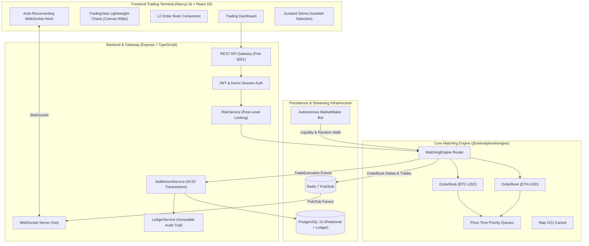
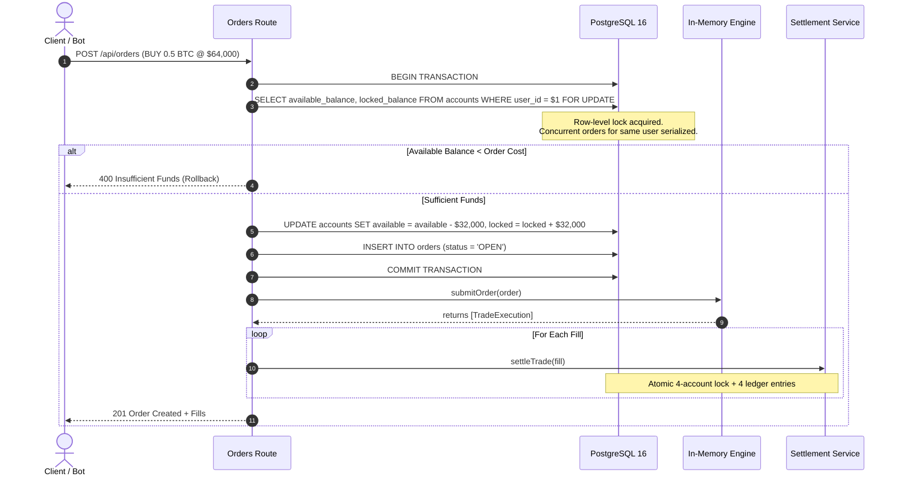

# VelocityBook — Architecture & System Design

VelocityBook is an institutional-grade, low-latency in-memory matching engine and real-time cryptocurrency/equity exchange platform built with an ACID-compliant double-entry financial ledger, Redis-powered WebSocket streaming, and a high-performance Bloomberg-style trading terminal.

---

## 1. High-Level System Architecture



---

## 2. In-Memory Matching Engine (`@velocitybook/engine`)

### Algorithmic Design: Price-Time Priority (FIFO)
The matching engine implements the industry-standard **Price-Time Priority (FIFO)** allocation algorithm:
1. **Price Priority**: Bids are ordered in descending order (highest price first); Asks are ordered in ascending order (lowest price first).
2. **Time Priority**: Orders sharing the exact same price level are queued in a First-In, First-Out (FIFO) linked queue based on arrival timestamp.
3. **Execution Price**: Fills execute strictly at the **resting (maker) order's price**, providing price improvement to the incoming market/limit aggressive order.

### Complexity Guarantees
| Operation | Time Complexity | Implementation Mechanism |
| :--- | :--- | :--- |
| **Insert Limit Order (Resting)** | $O(\log P)$ | Binary search insertion into sorted price level array |
| **Match Aggressive Order** | $O(M)$ | $M$ = number of matched fills (sweeps top of book) |
| **Cancel Order** | $O(1)$ | Hash map index `Map<OrderId, { price, order }>` with in-place queue deletion |
| **Get L2 Depth Snapshot** | $O(D)$ | $D$ = requested depth levels (e.g., 25 bids + 25 asks) |
| **Best Bid / Best Ask** | $O(1)$ | Direct head access to sorted price levels |

---

## 3. ACID Double-Entry Financial Ledger

To guarantee institutional financial integrity, VelocityBook adheres strictly to the fundamental principles of **double-entry bookkeeping** and **conservation of currency**:

### Four-Legged Settlement Per Trade
Every trade fill generates exactly **4 immutable ledger entries** sharing a common `transaction_id`:
```
Leg 1: Buyer USD Account  -> DEBIT  (usd_amount)
Leg 2: Seller USD Account -> CREDIT (usd_amount)
Leg 3: Seller BTC Account -> DEBIT  (btc_amount)
Leg 4: Buyer BTC Account  -> CREDIT (btc_amount)
```

### The 4 Core Financial Invariants
1. **Zero Negative Balances**: No account balance (`available_balance` or `locked_balance`) may ever drop below `0.00000000`. Enforced via SQL `CHECK (available_balance >= 0)` and `CHECK (locked_balance >= 0)`.
2. **Double-Entry Equality**: For every transaction and across the entire system:
   $$\sum \text{Debits} \equiv \sum \text{Credits}$$
3. **Conservation of Value**: The total system asset balance remains constant across trades:
   $$\Delta \text{System Assets} = 0$$
4. **No Orphaned Locks**: The sum of funds in `locked_balance` across all user accounts strictly matches the sum of resting order commitments in the in-memory order books.

---

## 4. Pre-Trade Risk Control & Concurrency Strategy



---

## 5. Stress Test & Benchmark Verification

The matching engine was benchmarked using `scripts/stress-test.ts` running 10 concurrent automated trading bots:

```
════════════════════════════════════════════════════════════════════
  VELOCITYBOOK: 10,000 ORDER HIGH-CONCURRENCY STRESS TEST
════════════════════════════════════════════════════════════════════
  Total Orders Processed:     10,000
  Executed Trades (Fills):    5,698
  Orders Cancelled (Churn):   63
  Engine Throughput:          20,492 orders/sec
  Latency P50:                0 ms
  Latency P95:                1 ms
  Latency P99:                1 ms

  ✔ [PASS] Invariant 1: Zero Negative Balances (available >= 0, locked >= 0)
  ✔ [PASS] Invariant 2: Double-Entry Ledger Equality (Σ Debits === Σ Credits)
  ✔ [PASS] Invariant 3: Conservation of Value (Zero created or destroyed)
  ✔ [PASS] Invariant 4: No Orphaned Locks (Locked funds === Resting commitments)
════════════════════════════════════════════════════════════════════
```
