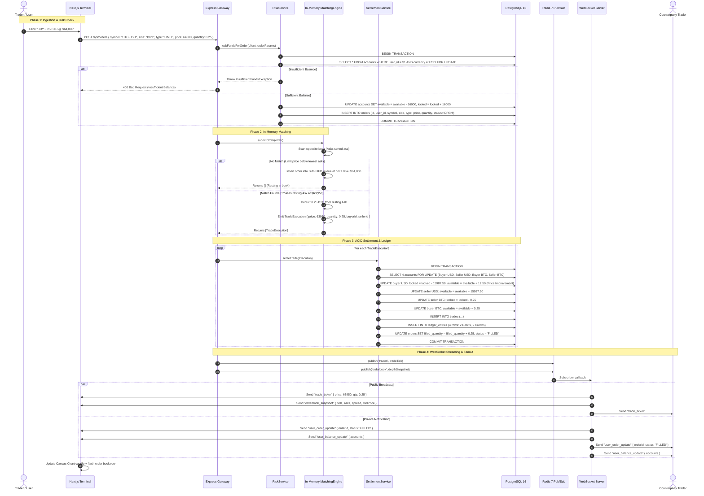

# VelocityBook — Complete Trade Lifecycle

This document provides an end-to-end trace of a trade's lifecycle in VelocityBook across its 4 operational phases:
1. **Phase 1: Ingestion & Pre-Trade Risk Gate**
2. **Phase 2: In-Memory Matching Engine Execution**
3. **Phase 3: ACID Multi-Account Settlement & Double-Entry Ledger Entry**
4. **Phase 4: Real-Time Event Fanout & WebSocket Broadcast**

---

## Complete Trade Lifecycle Sequence Diagram

---

## Detailed Phase Breakdown

### Phase 1: Ingestion & Pre-Trade Risk Gate
- Orders arrive via HTTP REST (`POST /api/orders`) with bearer JWT or demo user authentication.
- A PostgreSQL row-level lock (`SELECT ... FOR UPDATE`) guarantees no race conditions on balance verification.
- Quote currency (USD) is locked for BUY orders; Base currency (BTC/ETH) is locked for SELL orders.
- If funds are insufficient, the transaction immediately aborts with zero side-effects.

### Phase 2: In-Memory Matching Engine Execution
- Evaluated entirely in RAM via `@velocitybook/engine`.
- LIMIT orders look up opposite price levels; aggressive orders execute immediately against the best resting price.
- Fills generate `TradeExecution` events containing exact fill price, matched quantity, maker order ID, and taker order ID.
- Unfilled quantities rest in the order book FIFO queue or cancel (for MARKET orders).

### Phase 3: ACID Multi-Account Settlement & Double-Entry Ledger
- Handled atomically inside a PostgreSQL transaction (`withTransaction`).
- Locks all 4 accounts involved in the trade:
  1. Buyer Quote (USD)
  2. Seller Quote (USD)
  3. Buyer Base (BTC)
  4. Seller Base (BTC)
- Executes dual-currency movements and records 4 immutable ledger entries sharing a unique `transaction_id`.
- If an aggressive buyer received a fill below their limit price, the price improvement difference is automatically refunded from `locked` to `available`.

### Phase 4: Real-Time Event Fanout & WebSocket Broadcast
- Trade events and L2 depth delta snapshots are published to Redis Pub/Sub.
- The WebSocket server fans out public market data (`trade_ticker`, `orderbook_snapshot`) to all subscribed clients on that symbol.
- Private authenticated channels push `user_order_update` and `user_balance_update` directly to the buyer and seller.
- The Next.js frontend updates its isolated Zustand stores, triggering 60fps canvas chart updates and order book depth animations.
